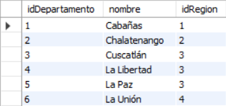

# Proyecto 2
### INTRODUCCION

La necesidad de tener sistemas escalables y óptimos depende principalmente de un
buen diseño de base de datos. Si bien existen sistemas antiguos que funcionan así,
con una metodología de almacenamiento de información en archivos planos con
datos redundantes y con datos no atómicos, éstos a lo largo del tiempo llegan a
impactar de forma considerable el rendimiento del propio sistema. Por lo anterior
muchas organizaciones aceptan el reto de migrar sus sistemas a bases de datos
formalizadas que les permita mejorar su rendimiento y su escalabilidad.

### ENUNCIADO
--- 

 El Instituto Centroamericano Electoral es una institucio´n dedicada a registrar,
controlar y evaluar estadi´sticas de los comicios electorales en los diferentes pai´se
de Centro Ame´rica, para lo cual requiere un sistema de bases de datos donde se
puedan hacer consultas de diferentes temas electorales.

  Los países están divididos en regiones. Cada región está formada por un conjunto
de departamentos o provincias, y cada provincia tiene un conjunto de municipios. A
cualquiera de estos (país, municipio, departamento o región) se le llama una zona.
Para la institución no es importante llevar información de los datos de los
ciudadanos, pues el voto es secreto. Sin embargo, es importante tener información
sobre las características generales de la población para tomar estadísticas respecto
al voto. Así, a la población se le puede clasificar de diferentes maneras,
dependiendo del tipo de información que la institución quiera saber. Por ejemplo, por
sexo: hombres, mujeres; por educación mínima: analfabetos, alfabetos; por raza:
indígenas, ladinos, garífunas, etc.; por escolaridad: primaria, nivel medio,
universitario; por edad: joven, adulto, tercera edad. Estos son solo ejemplos, pero la
institución puede dividir a los votantes de la forma que considere adecuada para
manejar información y tomar decisiones. De esta manera se puede saber si los
jóvenes, o las mujeres o los analfabetos votan más, en qué país, municipio,
departamento, etc. hay más votantes universitarios. Lo interesante además, es que
se quiere llevar información de elecciones de diferentes años para hacer
comparaciones. En cada elección es importante el año y el tipo de elección o el
nombre que se le coloca en cada país.Por ejemplo elecciones generales,
municipales, etc. del año 2007 en Guatemala.

Cada eleccio´n tiene un conjunto de puestos de eleccio´n popular que se definen en
cada pai´s y que abarcan una zona preestablecida (pai´s, regio´n, departamento o
municipio). Por ejemplo, un puesto de eleccio´n en Guatemala puede ser de alcalde
y por municipio, es decir, se eligen alcaldes para cada municipio. Otro puesto de
eleccio´n es el de presidente, pero e´ste es por pai´s. La eleccio´n de diputados es
regional. La eleccio´n de gobernadores es departamental. Una eleccio´n puede tener
elecciones de diputados, presidentes, alcaldes, gobernadores, etc. De tal forma que
se vota por presidente en todo el pai´s, pero para alcalde en cada municipio, asi´ los
ciudadanos que votan por un alcalde en su municipio no pueden votar por alcalde
en otro municipio, por ejemplo.

Los ciudadanos votan para un puesto de eleccio´n por candidatos que deben, por
ley, ser propuestos por partidos poli´ticos o comite´s ci´vicos. De esta forma, los
partidos poli´ticos participan para ser electos en cualquier puesto de eleccio´n que
quieran. Por ejemplo, el partido ABC participa en Guatemala, para elecciones de
presidente y diputados, otros partidos participara´n en otros puestos de eleccio´n
Esto es igual en todos los pai´ses. No es importante saber el nombre del candidato,
sino solamente del partido poli´tico en cada pai´s, que participa en una eleccio´
especi´fica por un puesto de eleccio´n en una zona del pai´s. Bajo este esquema, se
puede saber cua´ntos votos obtuvo un partido poli´tico en determinada eleccio´n para
determinado puesto de eleccio´n, en una zona dada y las caracteri´sticas de los
votantes (raza, escolaridad, sexo, etc.).

### MODELO LOGICO
---

### MODELO RELACIONAL
---

### LISTADO DE ENTIDADES
---
1. Eleccion
2. Detalle_Eleccion
3. FechaEleccion
4. Raza
5. Sexo
6. Partido
7. Municipio
8. Departamento
9. Region
10. Pais

### LISTADO DE ATRIBUTOS
---
1. Eleccion

2. Detalle_Eleccion

3. FechaEleccion

4. Raza

5. Sexo

6. Partido

7. Municipio

8. Departamento

9. Region

10. Pais

### RELACION ENTRE ENTIDADES
---
* Una ELECCION puede tener uno o muchos de DETALLE_ELECCION.
* Una RAZA puede tener uno o muchos de DETALLE_ELECCION.
* Un SEXO puede tener uno o muchos de DETALLE_ELECCION.
* Una FECHA_ELECCION puede tener uno o muchos de DETALLE_ELECCION.
* Una PARTIDO puede tener uno o muchos de DETALLE_ELECCION.
* Un PAIS puede tener uno o muchos de REGION.
* Un MUNICIPIO puede tener uno o muchos DETALLE_ELECCION, puede tener un unico de DEPARTAMENTO.
* Una REGION puede tener uno o muchos de DEPARTAMENTO, puede tener un unico de PAIS.
* Un DEPARTAMENTO puede tener uno o muchos de municipios, puede tener un unico de REGION.
* Un DETALLE_ELECCION puede tener un unico de RAZA,puede tener un unico de SEXO,puede tener un unico de ELECCION,puede tener un unico de PARTIDO, puede tener un unico de MUNICIPIO, puede tener un unico de FECHA_ELECCION.

### RESTRICCIONES A UTILIZAR
---
* En tabla SEXO se creo una restriccion para que solo sea mujeres y hombres

### CONSIDERACIONES DE DISEÑO
---
* Se creo la entidad RAZA para evitar redundancia de datos.
* Se creo la entidad SEXO para evitar redundancia de datos.
* Se creo la entidad ELECCION para evitar redundancia de datos.
* Se creo la entidad FECHA_ELECCION para evitar redundancia de datos.
* Se creo la entidad PARTIDO para evitar redundancia de datos.
* Se creo la entidad DETALLE_ELECCION sin llave primaria.

### NORMALIZACION
---
Estos son los datos disponibles para la tabla temporal, de la cual se parte en la normalizacion.

Aplicando la primera forma normal, la cual nos dice que se eliminan grupos repetidos en tablas individuales, se crea una tabla independiente para cada conjunto de datos relacionados
y se identifican cada conjunto de relacionados con la clave principal.

* Tabla Detalle Eleccion

* Tabla Sexo

* Tabla Raza

* Tabla Partido

* Tabla Fecha Eleccion

* Tabla Eleccion

* Tabla Municipio

Aplicando la segunda forma normal, esta asegura que cada atributo describe la entidad
y se crean tablas separadas para el conjunto de valores y los registros múltiples, estas tablas se deben relacionar con una clave externa.

* Tabla Pais

* Tabla Region

* Tabla Departamento

* Tabla Municipio

Aplicando la tercera forma normal, que comprueba las dependencias transitivas, eliminando campos que no dependen de la clave principal
por ello se tomo la tabla DETALLE_ELECCION sin clave principal.

* Tabla Detalle Eleccion

