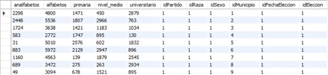
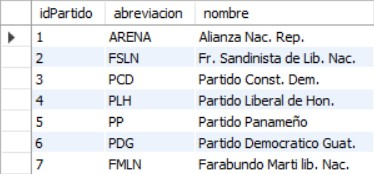

# Proyecto 2

### MODELO LOGICO
---

### MODELO RELACIONAL
---

### LISTADO DE ENTIDADES
---
1. Eleccion
2. Detalle_Eleccion
3. FechaEleccion
4. Raza
5. Sexo
6. Partido
7. Municipio
8. Departamento
9. Region
10. Pais

### LISTADO DE ATRIBUTOS
---
1. Eleccion

2. Detalle_Eleccion

3. FechaEleccion

4. Raza

5. Sexo

6. Partido

7. Municipio

8. Departamento

9. Region

10. Pais

### RELACION ENTRE ENTIDADES
---
* Una ELECCION puede tener uno o muchos de DETALLE_ELECCION.
* Una RAZA puede tener uno o muchos de DETALLE_ELECCION.
* Un SEXO puede tener uno o muchos de DETALLE_ELECCION.
* Una FECHA_ELECCION puede tener uno o muchos de DETALLE_ELECCION.
* Una PARTIDO puede tener uno o muchos de DETALLE_ELECCION.
* Un PAIS puede tener uno o muchos de REGION.
* Un MUNICIPIO puede tener uno o muchos DETALLE_ELECCION, puede tener un unico de DEPARTAMENTO.
* Una REGION puede tener uno o muchos de DEPARTAMENTO, puede tener un unico de PAIS.
* Un DEPARTAMENTO puede tener uno o muchos de municipios, puede tener un unico de REGION.
* Un DETALLE_ELECCION puede tener un unico de RAZA,puede tener un unico de SEXO,puede tener un unico de ELECCION,puede tener un unico de PARTIDO, puede tener un unico de MUNICIPIO, puede tener un unico de FECHA_ELECCION.

### RESTRICCIONES A UTILIZAR
---
* En tabla SEXO se creo una restriccion para que solo sea mujeres y hombres

### CONSIDERACIONES DE DISEÑO
---
* Se creo la entidad RAZA para evitar redundancia de datos.
* Se creo la entidad SEXO para evitar redundancia de datos.
* Se creo la entidad ELECCION para evitar redundancia de datos.
* Se creo la entidad FECHA_ELECCION para evitar redundancia de datos.
* Se creo la entidad PARTIDO para evitar redundancia de datos.
* Se creo la entidad DETALLE_ELECCION sin llave primaria.

### NORMALIZACION
---
Estos son los datos disponibles para la tabla temporal, de la cual se parte en la normalizacion.

Aplicando la primera forma normal, la cual nos dice que se eliminan grupos repetidos en tablas individuales, se crea una tabla independiente para cada conjunto de datos relacionados
y se identifican cada conjunto de relacionados con la clave principal.

* Tabla Detalle Eleccion

* Tabla Sexo

* Tabla Raza

* Tabla Partido

* Tabla Fecha Eleccion

* Tabla Eleccion

* Tabla Municipio

Aplicando la segunda forma normal, esta asegura que cada atributo describe la entidad
y se crean tablas separadas para el conjunto de valores y los registros múltiples, estas tablas se deben relacionar con una clave externa.

* Tabla Pais

* Tabla Region

* Tabla Departamento

* Tabla Municipio

