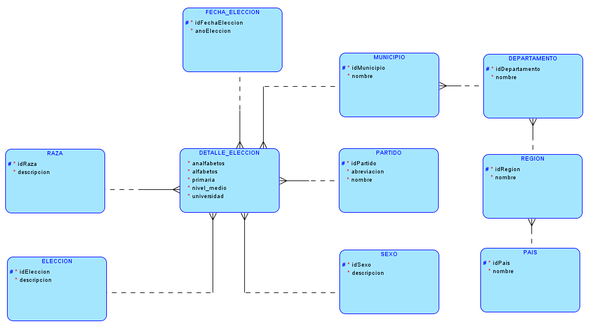
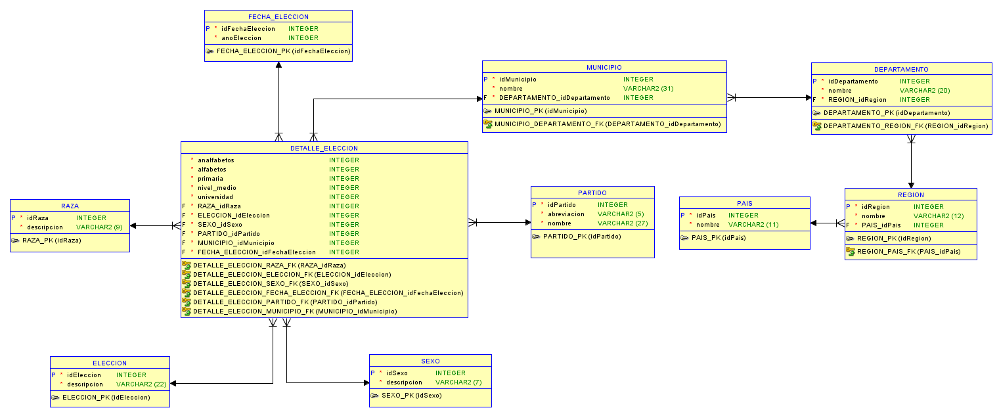

# Proyecto 2

### MODELO LOGICO
---

### MODELO RELACIONAL
---

### LISTADO DE ENTIDADES
---
1. Eleccion
2. Detalle_Eleccion
3. FechaEleccion
4. Raza
5. Sexo
6. Partido
7. Municipio
8. Departamento
9. Region
10. Pais

### LISTADO DE ATRIBUTOS
---
